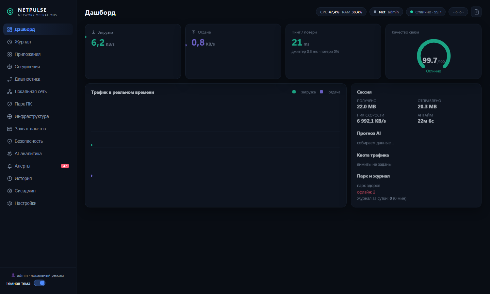
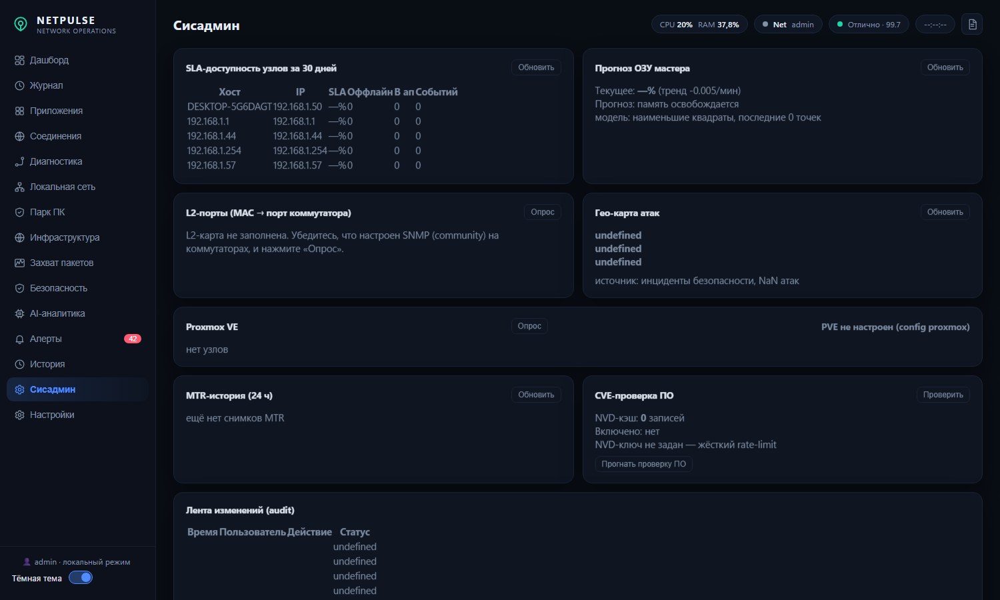

# NetPulse — центр сетевого мониторинга и автоматизации ИТ-отдела


<p align="center">
  
  
</p>

Локальный центр сетевых операций (NOC) и платформа автоматизации ИТ-отдела.
Один экземпляр разворачивается на машине администратора или внутреннем сервере;
рабочие станции сотрудников не требуют установки агентов. Все данные остаются
в контуре организации: облачные сервисы не используются.

---

## 1. Возможности

### Мониторинг сети
| Функция | Описание |
|---|---|
| Трафик | Скорость down/up в реальном времени, по интерфейсам, по процессам |
| Качество связи | Пинг, джиттер, потери → интегральная оценка 0–100 |
| Обнаружение устройств | Автоскан подсети (ping + ARP + reverse DNS), MAC и вендор, алерт о новом устройстве |
| Инфраструктура | Роутеры, коммутаторы, серверы: тип устройства, **SNMP v2c** (sysName, sysDescr, uptime), веб-интерфейс устройства в один клик |
| L2-карта | MAC → порт коммутатора (Bridge-MIB, SNMP-walk), соседи по LLDP, PTR-резолв имён |
| Диагностика | Ping-проба, traceroute, живой MTR, подбор DNS, speedtest; MTR-«веер» по расписанию с историей маршрутов |
| Прогноз дисков | Тренд заполнения по истории замеров: «хватит на N дней» |
| Прогноз ОЗУ | Наклон роста памяти мастера → прогноз до заполнения (`/api/ramforecast`) |
| SLA | Доступность каждого узла за период («SLA, %», события OFFLINE/ONLINE) |
| CVE-проверка | Инвентарь ПО сверяется с NVD API (кэш `sw_cve`, без ключа, rate-limited) |

### Платформа ИТ-отдела
| Функция | Описание |
|---|---|
| Журнал работ | Фиксация звонков и задач в одно действие; источники: вручную, сторож, runbook |
| Отчёты | TXT для руководства и CSV для Excel за любой период; формируются из БД автоматически |
| Парк ПК | Карточки машин, «карма» (health-score 0–100 с затуханием), события, история работ |
| Сторож ПК | Опрос парка через WinRM/WMI: диски, память, EventLog, офлайн-детект, ping-fallback для не-Windows устройств |
| Плановые работы | Повторяющиеся задачи с контролем просрочки и отметкой выполнения |
| Runbooks | Типовые операции кнопками (JSON-сценарии), полный аудит запусков |
| Сторож бэкапов | Контроль свежести копий критичных ресурсов + напоминание об учениях |
| Софт-инвентарь | Отчёты с машин по GPO-скрипту: что и где установлено |

### Безопасность
| Функция | Описание |
|---|---|
| IDS | Детект сканов портов, подозрительных подключений, скрытых процессов, правки hosts, автозагрузки; whitelist для ложных срабатываний |
| Firewall | Блокировка IP и приложений через Windows Firewall из дашборда |
| Аутентификация | Токены, брутфорс-защита (5 промахов → блок IP на 10 мин), бессрочная сессия админа, идентификация (`web_admins`) |
| Шифрование | Секреты конфига под Windows DPAPI; HTTPS (самоподписанный сертификат) |
| Гео-карта атак | Агрегация источников инцидентов по странам (локальная таблица, без внешних API) |
| Пороговые профили | Отдельные лимиты для серверов/роутеров/ПК по группам устройств (`quality.profiles`) |
| Whitelist MAC | Доверенные MAC не поднимают алерт нового устройства |
| Аудит | Все мутации через API — в append-only `audit_log` (кто, IP, действие, статус); секреты маскируются |
| Отказоустойчивость | Бэкап config.json перед каждым изменением (`backups/config/`, последние 10); ротация логов `logs/netpulse.log` |
| Каналы алертов | Telegram + generic Webhook (Slack/Discord/Mattermost/Teams); эскалация не-подтверждённых алертов |
| RBAC | Роли `admin`/`viewer` (`web_users`): viewer не может мутировать состояние через API |

### Системные
Prometheus `/metrics` • SSE-стрим живого состояния • автобэкап (WinRAR/zip) •
самодиагностика `/api/selftest` • Wake-on-LAN • RDP-переходы • тесты без
внешних зависимостей.

Еженедельный авто-отчёт (email/Telegram/webhook) • конфиг секретами через
`.env`/переменные окружения (`NETPULSE_*`) • печать топологии на A4 •
интеграция с Proxmox VE (статус нод/ВМ).

Идеи для развития — см. [IDEAS.md](IDEAS.md).

---

## 2. Архитектура

```
Браузер (SPA, vanilla JS)                      Рабочие станции сотрудников
     │  SSE + REST (токен)                          │
     ▼                                              │ GPO-скрипт (отчёт о ПО)
┌─────────────────────────────────────┐             │
│  HTTP-сервер (stdlib, порт 8770)    │◀────────────┘
│  ├ REST API · SSE · Prometheus      │
│  ├ Аутентификация · rate-limit      │
└──────────────┬──────────────────────┘
               ▼
┌─────────────────────────────────────┐        Удалённые устройства
│  MonitorService (фоновые потоки)    │      ┌────────────────────┐
│  ├ трафик, пинг, IDS, квоты         │─────▶│ ПК парка (WinRM)   │
│  ├ Сторож ПК · Инфраструктура (SNMP)│─────▶│ Роутеры/свитчи     │
│  ├ Журнал · Планировщик · Сторожа   │      └────────────────────┘
└──────────────┬──────────────────────┘
               ▼
        SQLite (WAL) — единое хранилище
```

Модули изолированы: каждый владеет своими таблицами БД, фоновые циклы
останавливаются через общий event.

---

## 3. Быстрый старт

**Требования:** Windows 10/11, Python 3.12+, права администратора (для полного
функционала).

```bash
pip install psutil                # единственная зависимость веб-версии
python -m netpulse                # дашборд: http://127.0.0.1:8770
```

Десктоп-версия (альтернативный UI, legacy):

```bash
pip install -r requirements.txt
python main.py
```

**Автозапуск с правами администратора:**

```powershell
schtasks /Create /TN "NetPulse" /SC ONLOGON /RL HIGHEST /F /TR ^
  "powershell -NoProfile -WindowStyle Hidden -File 'C:\путь\к\проекту\start_netpulse.ps1'"
```

---

## 4. Конфигурация (`config.json`)

Создаётся автоматически из значений по умолчанию. Секреты при сохранении
шифруются через DPAPI (префикс `dpapi:`).

| Секция / ключ | Назначение |
|---|---|
| `web_port` / `web_host` | Порт и интерфейс. `web_host: "0.0.0.0"` — доступ коллегам из сети (auth включится принудительно) |
| `web_auth_enabled`, `web_token` | Аутентификация. Токен передаётся заголовком `X-Auth` или `?token=` (SSE) |
| `web_admins` | Список админов: `[{"name": "Пётр", "token": "..."}]` — сервер помнит, кто вошёл; действия подписываются именем |
| `web_tls` | HTTPS: `{"enabled": true, "cert": "...", "key": "..."}`. Сертификат: `tools\make_cert.ps1` |
| `quality` | Пороги оценки качества связи (пинг/джиттер/потери) |
| `quota` | Лимиты трафика (день/месяц) и порог предупреждения |
| `ai` | Аномалии трафика: включение, порог, интервал обучения |
| `security` | Подозрительные порты, порог детекта скана |
| `ids` | Включение IDS, окно детекта, `whitelist` — правила ложных срабатываний |
| `infra` | SNMP community для опроса инфраструктуры |
| `lan` | `auto_scan_min` — период автоскана подсети (0 = выключить) |
| `watchdog` | Сторож ПК: `enabled`, `hosts: ["auto"]` (весь найденный парк), пороги дисков/памяти, список EventID |
| `runbooks` | Включение системы кнопок |
| `backupwatch` | Ресурсы для контроля свежести бэкапов |
| `planner` | Плановые работы: `tasks: [{"name": "...", "every_days": 14}]` |
| `speedtest` | URL и объёмы тестов скорости |
| `mtr` | Цель, макс. хопов, интервал цикла; `targets` — веер целей, `rotate_sec` — ротация |
| `telegram` | Уведомления в Telegram (токен шифруется DPAPI) |
| `backup` | Автобэкап проекта (WinRAR или zip) |
| `diagnostics` | Цели traceroute и резолвинга |
| `lan.trusted_macs` | Список доверенных MAC — не поднимают алерт нового устройства |
| `quality.profiles` | Пороговые профили: `server`/`router`/`pc` — лимиты по группам устройств |
| `web_users` | Роли: `[{"name": "...", "token": "...", "role": "viewer"}]` — viewer без прав на изменения |
| `escalate` | Эскалация: `enabled`, `unack_min`, `hook_url` (повтор не-принятых алертов) |
| `report.weekly` | Еженедельный отчёт: `enabled`, `day`, `time`, `to_email` |
| `proxmox` | PVE: `enabled`, `host`, `token_id`, `token_secret` |
| `geo` / `cve` | Селеция гео-агрегации и CVE-проверки: `enabled`, `nvd_key` |

Секреты можно задавать через переменные окружения `NETPULSE_*` или файл `.env`
в корне проекта — значения подставляются поверх `config.json` без правки файла.

---

## 5. Интерфейс

| Вкладка | Содержимое |
|---|---|
| **Дашборд** | Живые показатели, график трафика, сессия, прогноз AI, виджет «Парк и журнал» |
| **Журнал** | Быстрая фиксация работ, плановые задачи, отчёт + экспорт TXT/CSV |
| **Приложения** | Сетевая активность по процессам, новые соединения |
| **Соединения** | Все соединения и интерфейсы с привязкой к процессам |
| **Диагностика** | Ping-проба, traceroute, живой MTR, DNS, speedtest |
| **Локальная сеть** | Автоскан подсети, MAC/вендор, редактируемые алиасы устройств |
| **Инфраструктура** | Роутеры/коммутаторы/серверы: SNMP-информация, типы, веб-интерфейсы устройств, топология SVG |
| **Сисадмин** | SLA-доступность, прогноз ОЗУ, L2-порты, гео-карта атак, Proxmox, MTR-история, CVE, лента audit |
| **Парк ПК** | Карточки машин, карма, события, прогноз дисков, RDP/WoL/Ping, runbooks |
| **Захват пакетов** | Raw-socket перехват (требует прав администратора) |
| **Безопасность** | Сканер системы, IDS-лента, сканер портов хоста, правила firewall |
| **AI-аналитика** | Аномалии трафика, прогнозы |
| **Алерты** | Лента с дедупликацией, отметка «принято» |
| **История** | Графики за период из БД |
| **Настройки** | Все параметры выше + генерация токена |

---

## 6. REST API

Авторизация: заголовок `X-Auth: <токен>` (при включённой auth). Все мутации —
только `Content-Type: application/json` + `X-Auth` (анти-CSRF).

### Основные GET

| Эндпоинт | Назначение |
|---|---|
| `/api/state` | Живой снимок состояния |
| `/api/history?minutes=N` · `/api/dbhistory?hours=N` | Графики (память / БД) |
| `/api/connections` · `/api/interfaces` · `/api/topprocesses` | Сеть хоста |
| `/api/landevices` | Устройства ЛС + подсеть + главный узел |
| `/api/hosts` · `/api/hostdetail?id=` · `/api/events` | Парк и события |
| `/api/journal?limit=` · `/api/journalreport?days=` | Журнал и отчёт |
| `/api/planner` · `/api/softsearch?q=` · `/api/diskforecast` | Планы, софт, прогноз дисков |
| `/api/infra` | Инфраструктура (SNMP-данные, типы, шлюз) |
| `/api/l2map` · `/api/ptrs` | L2-карта (MAC→порт, LLDP) и PTR-резолв |
| `/api/sla?days=30` | SLA-доступность узлов |
| `/api/geomap?limit=` | Гео-агрегация источников атак |
| `/api/ramforecast` | Прогноз заполнения ОЗУ |
| `/api/mtrhistory?hours=24` | История MTR-циклов |
| `/api/cvestatus` · `/api/proxmox` | Статус CVE-кэша и нод Proxmox |
| `/api/reportpdf` | Текст еженедельного отчёта |
| `/api/runbooks` · `/api/backupstatus` · `/api/alerts` | Кнопки, бэкапы, алерты |
| `/api/ping?target=` · `/api/trace?target=` · `/api/dnsbest` | Диагностика |
| `/api/ai` · `/api/securityresult?job=` | AI и сканы безопасности |
| `/api/settings` · `/api/selftest` · `/api/meta` · `/api/whoami` | Конфиг, диагностика, карта, личность |
| `/metrics` | Prometheus-экспорт |
| `/api/stream` | SSE-стрим живого состояния |

### Основные POST

| Эндпоинт | Действие |
|---|---|
| `/api/journaladd` · `/api/journaldel` | Записи журнала |
| `/api/plannerdone` | Отметить плановую работу |
| `/api/runbookexec` | Выполнить runbook `{name, params}` |
| `/api/watchdogpoll` · `/api/healthrecompute` | Внеплановый обход парка, пересчёт кармы |
| `/api/infrascan` · `/api/infradtype` | Опрос инфраструктуры, тип устройства |
| `/api/l2scan` · `/api/lanalias` | Опрос L2-карты, алиас устройства |
| `/api/cvescan` · `/api/proxmoxpoll` | CVE-проверка ПО, опрос Proxmox |
| `/api/lanscan` | Скан подсети |
| `/api/wol` | Wake-on-LAN |
| `/api/idswl` | Правило whitelist IDS |
| `/api/fwblockip` · `/api/fwblockapp` · `/api/fwunblock` | Firewall |
| `/api/invreport` | Приём GPO-отчёта о ПО |
| `/api/backuprun` · `/api/backupcheck` | Бэкап и его контроль |
| `/api/login` | Вход (бессрочная cookie) |
| `/api/settings` · `/api/alertsack` · `/api/aitrain` | Конфиг, алерты, AI |

Специальные пути: `/journal.txt` и `/journal.csv` (отчёты), `/report.txt`
(сводка), `/api/gposcript` (GPO-скрипт инвентаря), `/api/rdp?host=`
(.rdp-файл), `/api/stream` (SSE).

---

## 7. GPO-инвентарь программного обеспечения

1. Скачайте скрипт: `http://<сервер>:8770/api/gposcript`
2. В шапке скрипта укажите `$NetPulseUrl` и (при включённой auth) `$NetPulseToken`
3. Разместите скрипт через GPO как startup-скрипт

Машины при каждом входе пользователя отправляют перечень ПО и характеристики —
данные появляются во вкладке «Парк ПК» и в поиске «Софт в парке».

---

## 8. Тесты

```bash
python -m tests.test_core        # ядро: БД, пингер, сниффер, парсеры
python -m tests.test_netpulse    # веб: сервер, auth, модули платформы
```

Собственный раннер (без pytest). CI: GitHub Actions прогоняет оба набора
на каждом пуше (`.github/workflows/tests.yml`).

---

## 9. Структура репозитория

```
netpulse/            веб-версия (основная)
  server.py            HTTP-сервер, REST/SSE/Prometheus, firewall, бэкапы
  services.py          MonitorService: трафик, пинг, IDS, MTR, сканер ЛС, SLA, гео, отчёты
  l2map.py             L2-карта: Bridge-MIB (SNMP-walk), LLDP, PTR
  geo.py               локальный резолвер IP → страна
  cve.py               CVE-проверка через NVD API (кэш sw_cve)
  proxmox.py           интеграция Proxmox VE (статус нод/ВМ)
  journal.py           журнал работ и отчёты
  inventory.py         парк машин, события, карма
  watchdog.py          сторож ПК (WinRM), прогноз дисков
  infra.py             инфраструктура: SNMP v2c (stdlib), авто-diff конфигов
  runbooks.py          кнопки операций + аудит
  planner.py           плановые работы
  backupwatch.py       контроль бэкапов
  softwareinv.py       приём GPO-отчётов о ПО
  wol.py               Wake-on-LAN
  config.py            конфигурация (глубокое слияние, DPAPI, NETPULSE_* env)
  web/                 дашборд (index.html, app.js, style.css, sw.js)
  gpo/                 скрипт инвентаря для GPO
  runbooks/            JSON-сценарии кнопок
core/                общее ядро: БД (WAL), пингер, сниффер, traceroute, security
ai/                  агенты аномалий и прогнозов
ui/                  desktop-интерфейс (legacy)
tools/               make_cert.ps1, mitm-шаблон для отладки
tests/               тесты (28)
docs/screens/        скриншоты дашборда
_legacy/             архив первой версии
IDEAS.md             бэклог идей сисадмина
```

---

## 10. Лицензия

MIT — см. [LICENSE](LICENSE).
